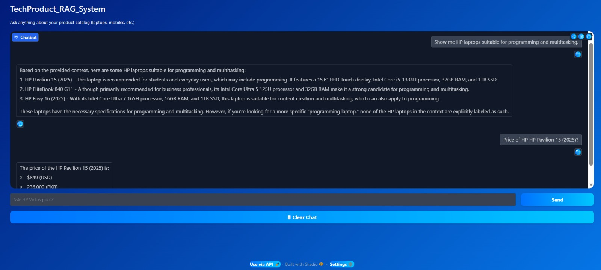

# TechProduct_RAG_System

An AI-powered ecommerce chatbot built using **Retrieval-Augmented Generation (RAG)** architecture for intelligent product search and context-aware responses.

---

# Table of Contents

* [Overview](#overview)
* [System Architecture](#system-architecture)
* [Problem Statement](#problem-statement)
* [Features](#features)
* [Technologies Used](#technologies-used)
* [Project Files](#project-files)
* [How It Works](#how-it-works)
* [Installation](#installation)
* [How to Run the Project](#how-to-run-the-project)
* [Sample Queries](#sample-queries)
* [Deployment](#deployment)
* [Results](#results)
* [Future Improvements](#future-improvements)
* [Project Configuration Files](#project-configuration-files)
* [Author](#author)

---

# Overview

**TechProduct_RAG_System** is an AI-powered ecommerce assistant that enables users to search and retrieve product information using natural language queries.

Instead of traditional keyword-based search, it uses **RAG (Retrieval-Augmented Generation)** with embeddings to understand user intent and deliver context-aware responses.

The system improves product discovery by combining:

* Semantic search
* Vector database (ChromaDB)
* Large Language Model (LLM)

---

# System Architecture

### How the system works in simple terms:

A user asks a question → system retrieves relevant products → AI generates final answer.

---

### Architecture Diagram



---

### Workflow

1. Load product catalog (CSV)
2. Convert data into LangChain documents
3. Split into chunks
4. Generate embeddings (Hugging Face)
5. Store embeddings in ChromaDB
6. Perform similarity search
7. Retrieve relevant context
8. Pass to Groq LLM
9. Generate response
10. Display via Gradio UI

---

# Problem Statement

Traditional ecommerce search systems:

* Fail to understand user intent
* Depend only on keyword matching
* Produce irrelevant results for complex queries

### This project solves it using:

✔ Semantic understanding
✔ Context-aware AI responses
✔ RAG-based architecture

---

# Features

* AI-powered ecommerce chatbot
* Semantic product search
* Retrieval-Augmented Generation (RAG)
* Context-aware responses
* ChromaDB vector database
* Hugging Face embeddings
* Groq LLM integration
* Gradio chatbot interface
* Real-time AI responses

---

# Technologies Used

### Programming Language

* Python

### Libraries & Frameworks

* LangChain
* ChromaDB
* Hugging Face Transformers
* Groq API
* Gradio
* Pandas
* python-dotenv

### Models

* **LLM:** llama-3.3-70b-versatile
* **Embeddings:** all-MiniLM-L6-v2

---

# Project Files

### `rag_backend.py`

Handles backend logic:

* Data loading
* Text chunking
* Embedding generation
* Vector DB creation
* Semantic retrieval
* LLM response generation

---

### `app.py`

Handles frontend logic:

* Gradio UI
* Chat interface
* User interaction
* Chat history

---

# How It Works

### 1. Load Dataset

```text id="data1"
products_catalog_v2.csv
```

### 2. Chunking

* Chunk Size: 500
* Overlap: 100

### 3. Embeddings

* Model: all-MiniLM-L6-v2

### 4. Vector Database

* ChromaDB stores embeddings

### 5. Retrieval

* Similarity search (k=8)

### 6. Response Generation

* LLM: llama-3.3-70b-versatile via Groq API

---

# Installation

### 1. Install dependencies

```bash id="inst1"
pip install -r requirements.txt
```

---

### 2. Create `.env` file

```env id="env1"
GROQ_API_KEY=your_groq_api_key_here
HF_TOKEN=your_huggingface_token_here
```

---

### 3. Add dataset

```text id="data2"
products_catalog_v2.csv
```

---

# How to Run the Project

```bash id="run1"
python app.py
```

Then open the URL such as:

```text id="run2"
http://127.0.0.1:7860
```

---

# Sample Queries

* Best gaming laptop under budget
* Show HP Victus specifications
* RTX laptops under 1500$
* Best battery phone
* Lenovo Legion price

---

# Deployment

This project can be deployed using:

* Hugging Face Spaces
* Gradio Interface

### Required Secrets:

* GROQ_API_KEY
* HF_TOKEN

---

# Results

* Improved semantic search accuracy
* Better understanding of user intent
* Faster product discovery
* Context-aware AI responses
* Real-time chatbot interaction

---

# Future Improvements

* Memory-based chatbot
* Hybrid search (BM25 + embeddings)
* Recommendation engine
* Multi-language support
* User authentication
* Cloud vector database

---

# Project Configuration Files

## requirements.txt

```txt id="req1"
pandas
langchain
langchain-community
langchain-core
langchain-text-splitters
langchain-chroma
chromadb
sentence-transformers
gradio
groq
python-dotenv
```

---

## .env

```env id="env2"
GROQ_API_KEY=your_groq_api_key_here
HF_TOKEN=your_huggingface_token_here
```

---

# Author

**Romesa Aleem**

📧 Email: [romesaaleem29@gmail.com](mailto:romesaaleem29@gmail.com)

🔗 LinkedIn: [https://www.linkedin.com/in/romesa-aleem-4a53b7248/](https://www.linkedin.com/in/romesa-aleem-4a53b7248/)

---

